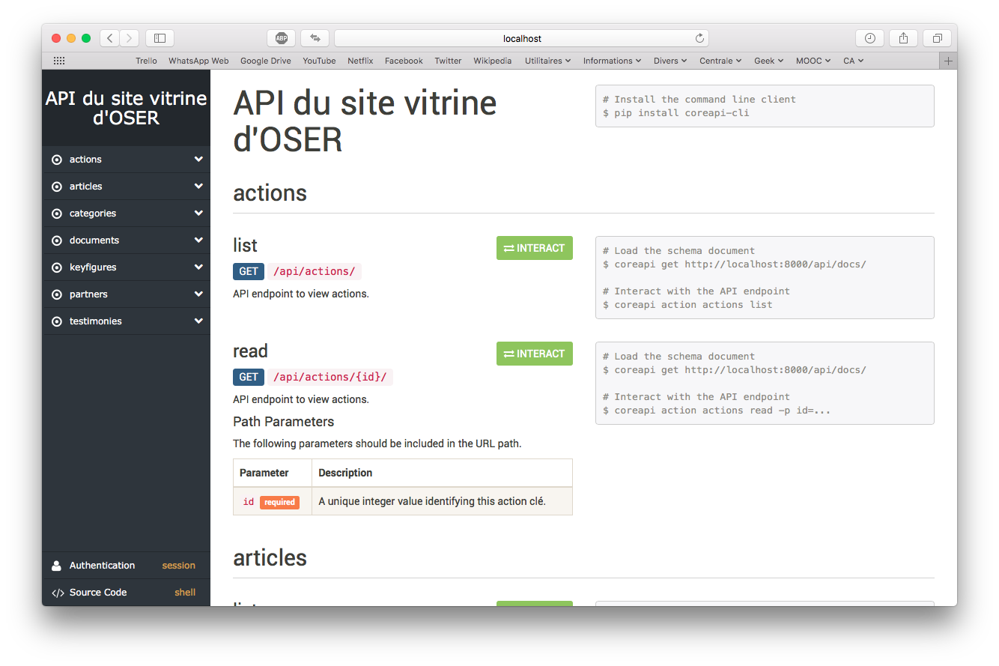

# Site vitrine d'OSER - Backend

<p align="center"></p>

<!-- Badges issus de Shields.io.

Les badges sont générés à partir de l'URL, qui ressemble à ceci :
https://img.shields.io/badge/<label>-<status>-couleur>.svg

Plus d'informations sur leur site : http://shields.io
-->

[](https://docs.python.org/3/)
[](https://www.djangoproject.com)
[

Bienvenue ! Ce dépôt est le lieu de développement du backend du site vitrine de l'association OSER.

Ce backend gère les resources telles que les articles, témoignages et autres données liées au site vitrine. Les resources sont exposées via une API.

Voir aussi :

- [Dépôt du site membres](https://github.com/oser-cs/oser-backend/).

## Table des matières

- [Installation](#installation)
- [Dépendances](#dépendances)
- [À propos d'OSER](#À-propos-doser)

## Installation

Cette section vous explique comment installer le site sur votre ordinateur pour le faire tourner en mode développement.

### Logiciels

- [Python 3.5+](https://www.python.org/downloads/)
- [PostgreSQL](https://www.postgresql.org/download/)

Après avoir installé PostgreSQL, **démarrez le serveur** en ouvrant pgAdmin, l'interface graphique qui sera installée en même temps que Postgres.

Il vous faut aussi créer la base de données appelée `oser_showcase_backend_db`.
Pour cela, l'utilitaire `psql` devrait s'être installé avec PostgreSQL, donc
exécutez la commande suivante :

```sh
$ psql -c "create database oser_showcase_backend_db"
```

- Optionnel : [Redis](https://redis.io) et [supervisord](http://supervisord.org) (utilisés par le gestionnaire de tâches [Celery](http://www.celeryproject.org))

Supervisord permet de lancer Redis (un système de *messaging*) et Celery en une seule commande, à exécuter à la racine du dépôt :

```sh
$ supervisord
```

Supervisord ne supporte toujours pas officiellement Python 3, mais c'est le cas pour la dernière version de développement. Installez-donc celle-ci :

```sh
$ pip install git+https://github.com/Supervisor/supervisor.git
```

> Il n'est pas obligatoire d'installer Redis, supervisord et Celery en développement. Sachez simplement alors que le test d'intégration associé échouera lorsque vous exécuterez les tests.

### Installation du projet

- Créez un environnement virtuel (appelé `env`) puis activez-le :

```bash
$ python -m venv env
$ source env/bin/activate
```

- Installez les dépendances :

```bash
$ pip install -r requirements.txt
```

- Configurez la base de données en exécutant les migrations (rappelez-vous : *le serveur PostgreSQL doit être actif*) :

```bash
$ cd project
$ python manage.py migrate
```

Il ne vous reste plus qu'à lancer le serveur de développement :
```bash
$ python manage.py runserver
```

Celui-ci sera accessible à l'adresse http://localhost:8000.

### Accéder à l'administration

L'interface d'administration du site permet d'effectuer des opérations d'administration (gestion des permissions utilisateur, modifications de données…). Elle permet en particulier aux gestionnaires du site vitrine d'apporter des modifications à son contenu ainsi que d'éditer des articles.

Lorsque vous accédez au site (par exemple à http://localhost:8000), vous êtes redirigés vers la page d'authentification. Authentifiez-vous avec un compte autorisé (compte administrateur ou autre compte avec le statut `staff`).

En développement, si vous venez d'installer le site, il n'y a pas encore d'utilisateurs dans la BDD. Il vous faut donc créer un compte administrateur. Pour cela, exécutez la commande `initadmin` :

```bash
$ python manage.py initadmin
```

Les identifiants par défaut sont indiqués dans le fichier `settings/common.py`. En production, pensez à mettre à jour le mot de passe de ce compte !

> Pour des raisons de sécurité, cette commande produira une erreur si des utilisateurs existent déjà dans la base de données. Vous ne pouvez donc l'exécuter que sur une BDD vide.

### Documentation de l'API

En développement, vous pouvez  accéder à la documentation de l'API à l'adresse http://localhost:8000/api/docs.

Vous pouvez aussi librement parcourir l'API à l'adresse http://localhost:8000/api.

Vous pouvez également accéder à la documentation de [l'API en production](http://oser-showcase-backend.herokuapp.com/api/docs).



## Dépendances

### Django

[Django](https://www.djangoproject.com) est un framework de développement web pour Python. Le site d'OSER utilise Django en version 2.0.

### Django REST Framework

Le [Django REST Framework](http://www.django-rest-framework.org) (DRF) permet d'écrire facilement des API REST avec Django.

Le site d'OSER utilise le DRF en version 3.8+.

## À propos d'OSER

OSER, ou Ouverture Sociale pour la Réussite, est une association étudiante de CentraleSupélec œuvrant dans le cadre des Cordées de la Réussite. Elle accompagne des jeunes issus de tous milieux sociaux et leur propose à cet effet un programme de tutorat, des sorties culturels, des séjours thématiques ou encore des stages de découverte.
